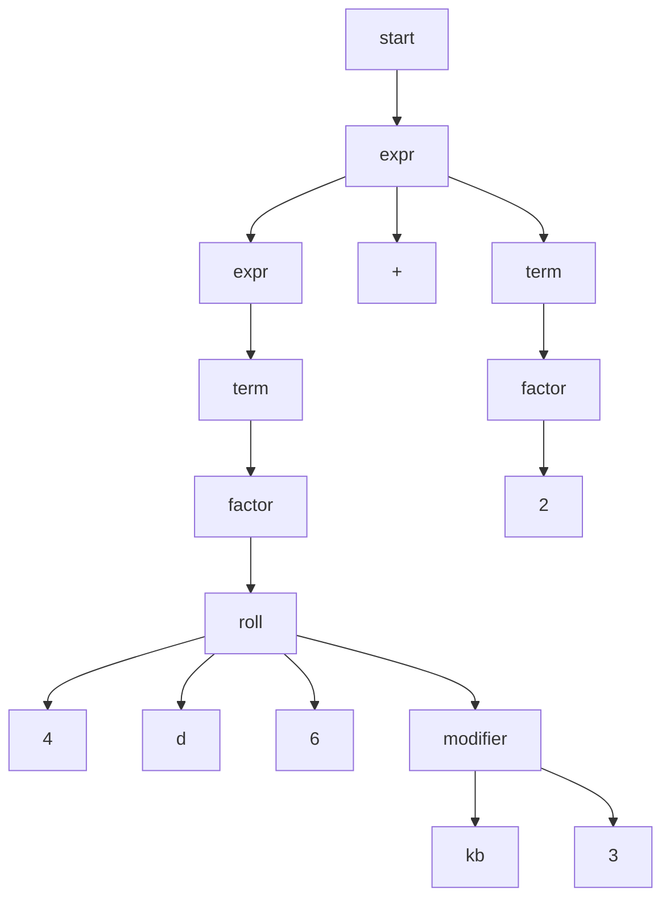

```mermaid
graph TD
    start --> expr0["expr"]
    expr0 --> exprA["expr"]
    expr0 --> plus["+"]
    expr0 --> term2["term"]

    exprA --> term1["term"]
    term1 --> factor1["factor"]
    factor1 --> roll1["roll"]
    roll1 --> n4["4"]
    roll1 --> d1["d"]
    roll1 --> n6["6"]
    roll1 --> mod["modifier"]
    mod --> kb["kb"]
    mod --> n3["3"]

    term2 --> factor2["factor"]
    factor2 --> n2["2"]
```