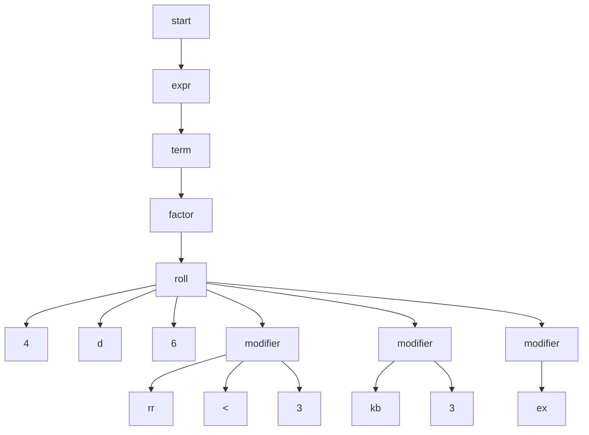

Árvore de derivação de `4d6 rr<3 kb3 ex` segundo `dice.lark` (usada por `dice_dsl.py`)

Na gramática, `roll: NUMBER "d" NUMBER modifier*` é uma regra só, então os
modificadores são filhos diretos de `roll`, na ordem em que aparecem na string
(`rr`, `kb`, `ex`). A ordem de aplicação (`rr` → `min` → `kb`/`ks` → `ex`) é
definida em `run_single_roll`, não pela árvore.
