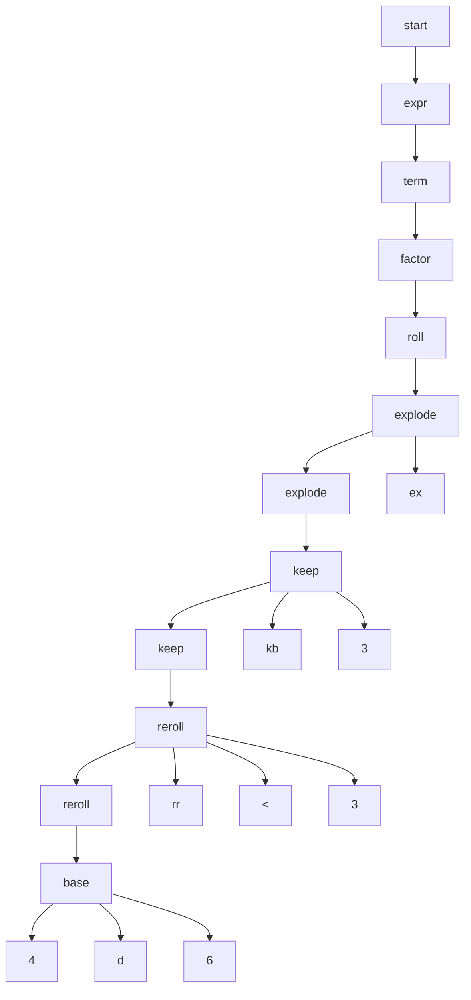

Árvore de derivação de `4d6 rr<3 kb3 ex`

```mermaid
graph TD
    start --> expr["expr"]
    expr --> term["term"]
    term --> factor["factor"]
    factor --> roll["roll"]
    roll --> explode0["explode"]

    explode0 --> explode1["explode"]
    explode0 --> ex["ex"]

    explode1 --> keep0["keep"]

    keep0 --> keep1["keep"]
    keep0 --> kb["kb"]
    keep0 --> n3b["3"]

    keep1 --> reroll0["reroll"]

    reroll0 --> reroll1["reroll"]
    reroll0 --> rr["rr"]
    reroll0 --> comp["&lt;"]
    reroll0 --> n3a["3"]

    reroll1 --> base["base"]
    base --> n4["4"]
    base --> d["d"]
    base --> n6["6"]
```
